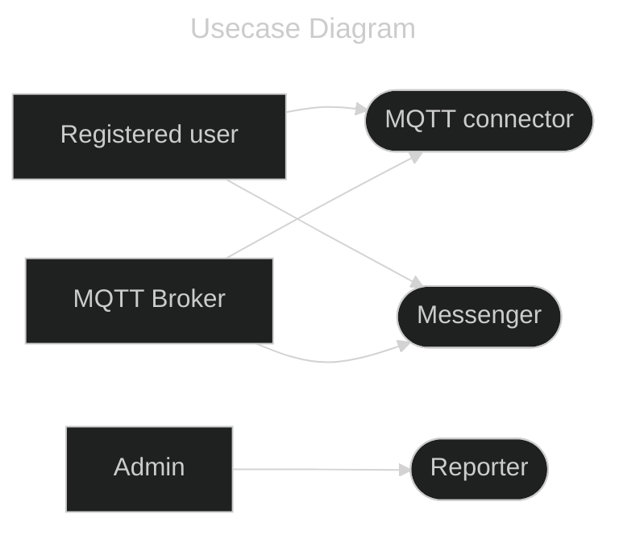
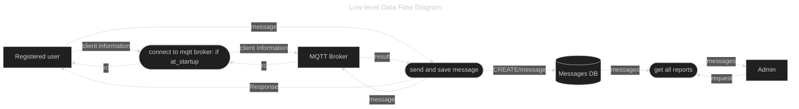
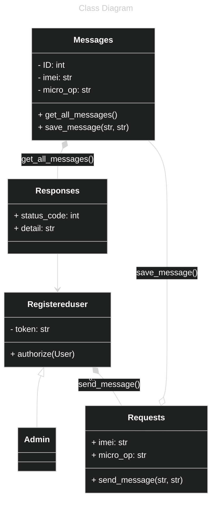
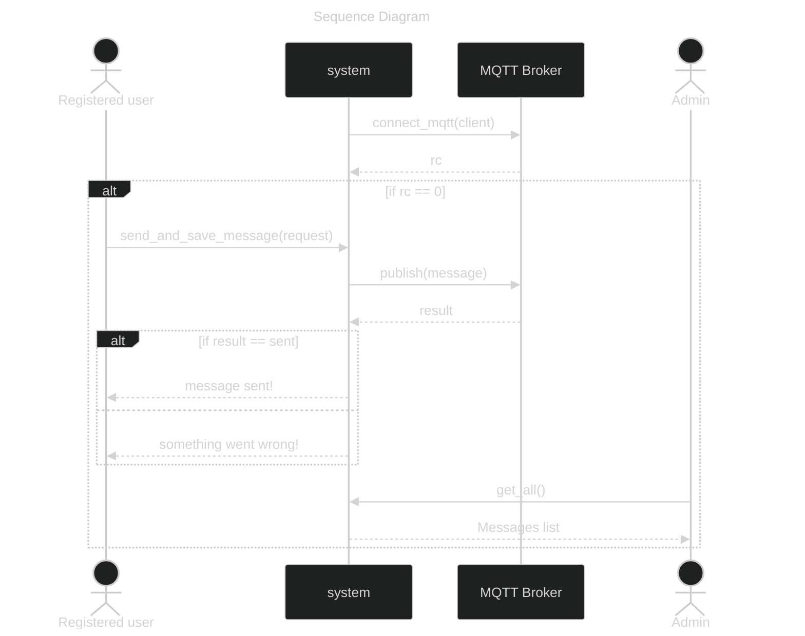

# نمودارهای پروژه

```mermaid 
---
title: Usecase Diagram
---
%%{
  init: {
    'theme': 'dark',
    'themeVariables': {
      'primaryTextColor': '#fff',
      'tertiaryColor': '#fff'
    }
  }
}%%
flowchart LR
    A[Registered user] --> C([MQTT connector])
    B[MQTT Broker] --> C
    A --> D([Messenger])
    B --> D
    E[Admin] --> F([Reporter])
```

```mermaid
---
title: Low-level Data Flow Diagram
---
%%{
  init: {
    'theme': 'dark',
    'themeVariables': {
      'primaryTextColor': '#fff',
      'tertiaryColor': '#fff'
    }
  }
}%%
flowchart LR
    A[Registered user] -- client information --> B([connect to mqtt broker: if at_startup ])
    B -- rc --> A
    A -- message --> C([send and save message])
    C -- Response --> A
    C -- CREATE/message --> D[(Messages DB)]
    C -- message --> E[MQTT Broker]
    E -- result --> C
    B -- client information --> E
    E -- rc --> B
    F[Admin] --request--> G([get all reports])
    G -- messages --> F
    D -- messages --> G
```

```mermaid
---
title: Class Diagram
---
%%{
  init: {
    'theme': 'dark',
    'themeVariables': {
      'primaryTextColor': '#fff',
      'tertiaryColor': '#000'
    }
  }
}%%
classDiagram
    class Messages{
        - ID: int
        - imei: str
        - micro_op: str
        + get_all_messages()
        + save_message(str, str)
    }
    class Requests{
        + imei: str
        + micro_op: str
        + send_message(str, str)
    }
    class Responses{
        + status_code: int
        + detail: str
    }
    class Registered user{
        - token: str
        + authorize(User)
    }
    class Admin{

    }
    Registered user <|-- Admin
    Registered user "0..*" *-- "0..*" Requests: send_message()
    Requests "1" o-- "1" Messages: save_message()
    Responses "0..*" --> "0..*" Registered user
    Messages "0..*" *-- "0..*" Responses: get_all_messages()
```

```mermaid
---
title: Sequence Diagram
---
%%{
  init: {
    'theme': 'dark',
    'themeVariables': {
      'primaryTextColor': '#fff',
      'tertiaryColor': '#fff'
    }
  }
}%%
sequenceDiagram
    actor Registered user
    participant system
    participant MQTT Broker
    actor Admin
    system ->> MQTT Broker: connect_mqtt(client)
    MQTT Broker -->> system: rc
    alt if rc == 0
        Registered user ->> system: send_and_save_message(request)
        system ->> MQTT Broker: publish(message)
        MQTT Broker -->> system: result
        alt if result == sent

            system -->> Registered user: message sent!
        else
            system -->> Registered user: something went wrong!
        end
        Admin ->> system: get_all()
        system -->> Admin: Messages list
    end
    
    
```

