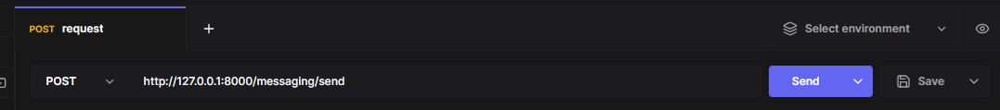
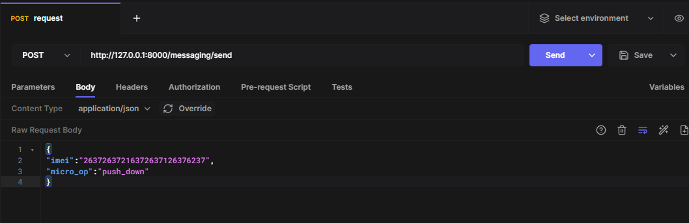
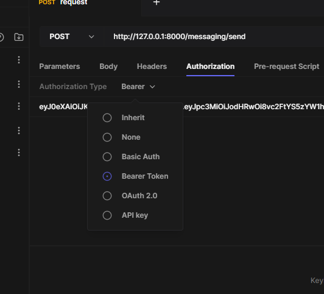
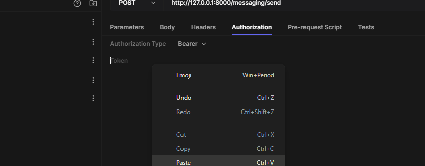

# **آموزش کار با پیامرسان**

!!! tip "یاد آوری"
    با توجه به اینکه این پیام رسان بر بستر API طراحی شده، **هیچ رابط کاربری ندارد** و
    باید با نرم افزار هایی نظیر [Postman](https://www.postman.com/) و یا [Hoppscotch](https://hoppscotch.io/) با این پیامرسان کار کنیم.(1) 
    { .annotate }

    1. در این آموزش از Hoppscotch بهره بردیم.

!!! warning "نکته خیلی خیلی مهم"
    با توجه به اینکه این نرم افزار از ماژول امنیتی OAuth 2 بهره می برد و باید از JWT برای احراز هویت آن استفاده کنید؛ 
    هیچ راهی جز ثبت نام در سایت [سما کنترل](https://samacontrol.com/) برای استفاده از این سرویس باقی نمی ماند.

## **آموزش ایجاد درخواست**

- _[**Hoppscotch**](https://hoppscotch.io/)_

ابتدا وارد نرم افزار Hoppscotch شده و از قسمت متد های ورودی، متد `POST` را انتخاب کنید؛ و در قسمت ورودی `http://127.0.0.1/messaging/send` را وارد کنید.

<figure markdown="span">
  
</figure>
سپس در تب `Body` یک ورودی با فرمت json وارد می کنیم که این ورودی باید به شکل زیر باشد:

```json
{
    "imei":"26372637216372637126376237", // کد شناسایی دستگاهی که در حال درخواست کردن می باشد
    "micro_op":"push_down" // عملیاتی که نیاز به انجام دادن آن دارید
}
```

همانند تصویر زیر: 

<figure markdown="span">
  
</figure>

حالا نیاز دارید که تنظیمات امنیتی را انجام دهید، برای همین منظور به تب `Authorization` مراجعه می کنیم.

در این تب `Authorization Type` را از منوی کشویی بر روی `Bearer Token` قرار میدهیم.

<figure markdown="span">
  
</figure>

حالا در ورودی Token، توکن دریافت شده از سامانه را وارد کرده تا در request header ما قرار بگیرد.

<figure markdown="span">
  
</figure>

???+ tip "نکته"
    **نیازی نیست** بخش امنیتی را مجددا برای هر درخواست تنظیم کنید!

حالا تمام تنظیمات انجام شده و شما می توانید با کلیک بر روی `Send` درخواست خود را ارسال کنید.

## **پاسخ برگردانده شده**

پس از ارسال در خواست توسط شما یا دستگاهتان یک پاسخ json بازگردانده می شود که به یکی از دوحالت زیر است:

=== "status code 200"
    ```json 
    {
        "detail": "Send `{published_message}` to topic `{topic}`"
    }
    ```
=== "status code 406"
    ```json 
    {
        "detail": "Somthing went wrong"
    }
    ```